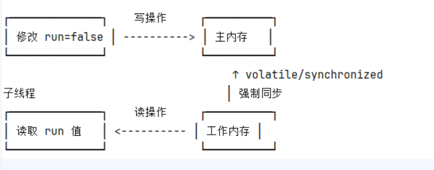

# 目录
- [1. java内存模型(JMM)](#java内存模型(JMM))
   - [1.1 变量存储位置](#变量存储位置)
   - [1.2 变量访问规则](#变量访问规则 )
   - [1.3 主内存、工作内存详解](#主内存、工作内存详解)
- [2. JMM的可见性和有序性](#JMM的可见性和有序性)
   - [2.1 volatile原理之保证可见性](#volatile原理之保证可见性)
   - [2.2 volatile原理之保证有序性](#volatile原理之保证有序性)
   - [2.3 happens-before规则](#happens-before规则)
   - [2.4 为何synchronized和lock锁可以保证可见性](#为何synchronized和lock锁可以保证可见性)


## java内存模型(JMM)
1. 变量存储位置
   1. 主内存：所有变量原始值的存储位置(堆内存)
   2. 工作内存：每个线程私有的变量副本缓存(cpu缓存/寄存器)

2. 变量访问规则 
   1. 普通变量：线程运行时，线程优先从线程的工作内存中读取缓存值，读取到值后，便把值写入到自己的工作内存中，方便减少对主内存的访问。
   2. volatile关键字修饰的变量：强制线程每次访问该变量都需要到主内存中读取，保证可见性。主线程
   3. 内存交互示意图如下
   
3. 主内存、工作内存详解
   1. 主内存：对应堆内存(存储对象实例，静态变量等)，所有线程共享，是变量的原始存储位置，线程必须通过特定操作(如volatile/锁)与主内存交互。
   2. 工作内存：对应CPU缓存/寄存器(存储线程操作所需的变量副本),是线程私有的，是线程操作变量的临时缓冲区，线程可以直接操作工作内存中的变量，而不需要通过主内存交互。
3. 内存屏障:内存屏障（Memory Barrier），又称内存栅栏（Memory Fence），是 CPU 或编译器提供的一种指令或机制，用于控制指令的执行顺序和内存的可见性。
> 他的核心作用是:
>> 1、禁止指令重排序：防止编译器和 CPU 为了提高性能而进行的指令重排序破坏程序逻辑。
>
>> 2、强制内存同步：确保多线程环境下，一个线程对共享变量的修改对其他线程可见。


## JMM的可见性和有序性
### volatile原理之保证可见性
volatile关键字是java语言的关键字，用来修饰成员变量和静态变量，可以避免线程从自己的工作缓存中查找变量的值，必须要到主内存中获取他的值，线程操作volatile关键字修饰的变量都是直接操作主内存的。
[volatile关键字可见性示例代码](src/main/java/com/daming/multithreading/Test26.java)
> volatile的底层实现原理是内存屏障，Memory Barrier
>> 对volatile变量的写指令后会加入写屏障   
>> 对volatile变量的读指令前加入读屏障

什么是内存屏障？
> 内存屏障是CPU或者编译器提供的一种指令级约束机制，用于：
>> 1、禁止特定类型的指令重排序（编译器和处理器层面的优化）  
>> 2、强制刷新/加载主内存和工作内存间的数据

内存屏障的作用：
> 类型：写屏障
>> 作用场景：volatile写操作之后插入
>>> 具体行为：将写屏障前的所有修改同步到主内存中，并禁止将这些写操作重排序到屏障之后
> 
> 类型：读屏障
>> 作用场景：volatile读操作之前插入
>>> 具体行为：强制重新从主内存加载数据，并禁止将这些读操作重排序到屏障之前

### volatile原理之保证有序性

### happens-before规则
> Happens-before是Java内存模型中定义的一种偏序关系，用于明确多线程环境下操作的可见性和有序性，它规定了:  
>> 如果A happens-before 操作B，那么A的结果对于B是可见的，且A的执行顺序在B之前(编译器和CPU不会重新排序破坏这种关系)

happens-before的六大核心规则：   
1、程序顺序规则:单线程内的操作按代码顺序执行（保证线程内的有序性）。
```java
int x=1; // 操作A
int y=x; // 操作B--> B操作一定能看到A的结果
```
2、volatile变量规则:对一个 volatile 变量的写操作 happens-before 后续对该变量的读操作。
```java
volatile boolean flag = false;

// 线程A
flag = true;  // 写操作 → 强制刷新到主内存

// 线程B
if (flag) {   // 读操作 → 强制从主内存读取最新值
    // 一定能看到线程A的修改
}
```
3、锁规则(监视器锁):解锁（unlock）一个锁 happens-before 后续加锁（lock）同一锁。
```java
 synchronized (lock) {
     // 线程A修改共享变量
     sharedData = 42;
 } // 解锁 → 强制刷新到主内存

 synchronized (lock) { 
     // 线程B读取 → 一定能看到线程A的修改
     System.out.println(sharedData); // 输出 42
 }
```
4、线程启动规则:主线程启动子线程（Thread.start()）前的操作 happens-before 子线程的任何操作。
```java
   int x = 10;
   new Thread(() -> {
       System.out.println(x); // 一定能看到 x=10
   }).start();
   
```
5、线程终止规则：子线程的所有操作 happens-before 主线程通过 Thread.join() 感知到该线程终止。
```java
   Thread t = new Thread(() -> {
       x = 20; 
   });
   t.start();
   t.join(); 
   System.out.println(x); // 一定能看到 x=20
```
6、传递性规则：若 A happens-before B，且 B happens-before C，则 A happens-before C。   

> happens-before的实现原理：其底层通过 内存屏障（Memory Barrier） 和 禁止指令重排序 实现，具体包括：
>> 1、内存屏障指令
>>>插入 LoadLoad、StoreStore、LoadStore、StoreLoad 等屏障，强制内存读写顺序。
>>>例如：volatile 写操作后插入 StoreLoad 屏障，确保写入结果对其他线程可见。
> 
>> 2、禁止编译器/CPU 重排序
>>>JMM 要求编译器生成的指令顺序符合 happens-before 规则。  
>>>CPU 不会对跨线程的依赖操作进行重排序优化。

### 为何synchronized和lock锁可以保证可见性
在Java中，synchronized关键字和lock能保证主内存变量的可见性，是因为他们通过内存屏障和happens-before规则强制实现了多线程间的内存同步。   
> synchronized的可见性保证
>> 1、锁的获取和释放语义：
>>> a、进入同步代码块之前：jvm会强制清空工作内存，从主内存重新加载共享变量（保证读取最新值）   
>>> b、退出同步代码块时：jvm会强制将工作内存的修改刷新到主内存（保证其他线程能看到修改）  
> 
>> 2、happens-before规则：
>>> a、线程A在synchronized块内的修改，对线程B后续进入同一个锁的同步块一定可见(线程B能看到线程A的所有修改)
> 
>> 3、内存屏障
>>> a、synchronized的实现是采用内存屏障来实现的，即在获取锁和释放锁时，会插入内存屏障，保证内存操作的顺序性

> lock的可见性保证
>> 1、lock的加锁与解锁语义：
>>> a、lock() 加锁时：强制从主内存读取共享变量的最新值（类似 synchronized 的进入同步块）。
>>> b、unlock() 解锁时：强制将工作内存的修改刷新到主内存（类似 synchronized 的退出同步块）。
>
>> 2、AQS（AbstractQueuedSynchronizer）机制：
>>> Lock 的实现类（如 ReentrantLock）底层依赖 AQS，通过 volatile 变量（如 state）和 CAS 操作 实现同步，间接保证了可见性。
> 
>> 3、happens-before规则：
>>> a、线程 A 在 unlock() 前的修改，对线程 B 后续通过 lock() 获得同一锁一定可见。