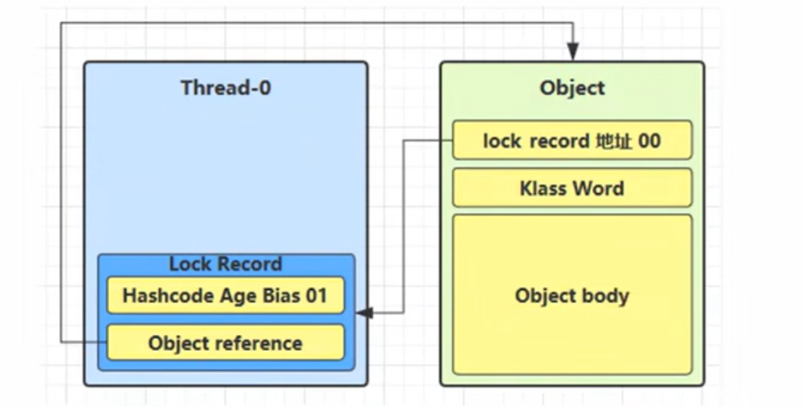

# 目录

## [1. 创建和运行线程](#创建和运行线程)
- [1.1 直接使用 Thread](#直接使用Thread)
- [1.2 使用 Runnable 接口](#使用Runnable接口)
- [1.3 使用 FutureTask 配合 Thread](#使用FutureTask配合Thread)

## [2. 查看进程和线程的方法](#查看进程和线程的方法)
- [2.1 Linux 命令](#linux命令)
- [2.2 JConsole 监控](#jconsole-监控)

## [3. start 和 run 方法](#start和run方法)

## [4. sleep 与 yield](#sleep与yield)
- [4.1 sleep 方法特性](#41-sleep-方法特性)
- [4.2 yield 方法特性](#42-yield-方法特性)

## [5. 共享模型之管程](#共享模型之管程)
- [5.1 共享问题](#共享问题)
- [5.2 synchronized 同步机制](#52-synchronized-同步机制)
   - [5.2.1 代码块同步](#521-代码块同步)
   - [5.2.2 方法同步](#522-方法同步)
- [5.3 线程安全分析](#线程安全分析)
- [5.4 Java 对象头](#Java对象头)
- [5.5 Monitor 机制](#Monitor)

## [6. synchronized 优化原理](#synchronized优化原理)
- [6.1 轻量级锁](#轻量级锁)
- [6.2 锁膨胀](#锁膨胀)
- [6.3 自旋优化](#自旋优化)
- [6.4 偏向锁](#偏向锁)
   - [6.4.1 偏向状态](#偏向状态)

## [7. wait/notify](#wait和notify)
- [7.1 等待/通知机制](#71-等待通知机制)
- [7.2 同步模式之保护性暂停](#同步模式之保护性暂停)

## [8. ReentrantLock简单解析](#ReentrantLock简单解析)
- [8.1 特性对比（vs synchronized）](#81-特性对比vs-synchronized)
- [8.2 可重入性](#可重入)
- [8.3 可打断性](#可打断)
- [8.4 锁超时](#锁超时)
- [8.5 公平锁](#公平锁)
- [8.6 条件变量](#条件变量)

## [附录](#附录)
- [代码示例链接](#代码示例链接)
- [相关示意图](#相关示意图)


## 创建和运行线程

1. 直接使用Thread

```java
// 创建线程对象
Thread t = new Thread() {
    public void run() {
        // 要执行的任务
    }
};
// 启动线程
t.

start();
```

[对应演示代码](src/main/java/com/daming/multithreading/Test1.java)

2. 使用Runnable接口

```java
Runnable runnable = new Runnable() {
    public void run() {
        // 要执行的任务
    }
};
// 创建线程对象
Thread t = new Thread(runnable);
// 启动线程
t.

start();
```

[对应演示代码](src/main/java/com/daming/multithreading/Test2.java)

>
>> 方法1是把线程和任务合并在一起，方法2是把线程和任务分开  
> > 用Runnable 更容易与线程池等高级API结合  
> > Runnable 让任务脱离了Thread继承体系，更灵活

3. 使用FutureTask配合Thread  
   FutureTask能够接收Callable类型的参数，用来处理有返回结果的情况

```java
// 创建任务对象

import java.util.concurrent.FutureTask;

FutureTask<Integer> task = new FutureTask<Integer>(() -> {
    System.out.println("hello");
    return 100;
});

// 参数1是任务对象，参数2是线程名字
new

Thread(task, "t1").

start();

Integer result = task.get();
System.out.

println("result="+result);
```

[对应演示代码](src/main/java/com/daming/multithreading/Test3.java)

## 查看进程和线程的方法

linux命令

```bash
# 查看所有进程
ps -fe 
# 查看指定进程的线程
ps -ft -p <PID> 
```

jconsole-监控

```bash
java -Dcom.sun.management.jmxremote -Dcom.sun.management.jmxremote.port=1888 -Dcom.sun.management.jmxremote.rmi.port=1888  -Dcom.sun.management.jmxremote.authenticate=false -Dcom.sun.management.jmxremote.ssl=false -Djava.rmi.server.hostname=192.168.1.146 Test5
```

## start和run方法

>
>> start方法会创建一个新线程，并调用线程的run方法

## sleep与yield

> sleep
>> 1、调用sleep会让当前线程从Running进入Timed Waiting状态  
> > 2、其他线程可以使用 interrupt方法进行打断正在睡眠的线程，这时sleep方法会抛出
> > InterruptedException,不会继续执行睡眠时间结束后的代码  
> > 3、睡眠结束后的线程未必会立刻执行  
> > 4、建议用TimeUnit 的 sleep 代替Thread 的sleep 来获得更好的特性  
[对应sleep演示代码](src/main/java/com/daming/multithreading/Test6.java)  
[对应sleep被中断的代码演示](src/main/java/com/daming/multithreading/Test7.java)

> yield
>>
1、调用yield会让当前线程从Running进入Runnable，然后调度执行其他同优先级的线程。如果这时没有同优先级的线程，那么不能保证当前线程的暂停效果
> > 2、具体的实现依赖于操作系统的任务调度器

## 共享模型之管程

1. 共享问题  
   [共享问题的代码演示](src/main/java/com/daming/multithreading/Test8.java)
    1. 一个程序运行多个线程本身是没问题的
    2. 问题出在多个线程访问共享资源
        1. 多个线程读共享资源其实也没问题
        2. 在多个线程对共享资源读写操作发生指令交错，就会出现问题
    3. 一段代码块内如果存在对共享资源的多线程读写操作，称这段代码块为临界区
    4. 多个线程在临界区内执行，由于代码的执行序列不同而导致结果无法预测，称之为发生了竞态条件
2. synchronized    
   为了避免临界区的竞态条件发生，有多种手段可以达到目的
    1. 阻塞式的解决方案：synchronized，Lock
    2. 非阻塞式的解决方案：原子变量(CAS)

```java
synchronized (对象){
临界区
}
```

[上述共享问题的解决方法实例代码](src/main/java/com/daming/multithreading/Test9.java)
> 思考：
>
>如果把synchronized(obj)放在for循环外面，如何理解，会发生什么效果？
>> 结果不会发生变化，只不过执行的流程，t2需要等到t1的循环执行完后释放锁，再执行t2
>
>如果t1 synchronized(obj1)而t2 synchronized(obj2)，如何理解，会发生什么效果？
>> 结果出现线程安全问题，结果不可预估，因为t1和t2获取的锁对象不一样，无法保证临界区的代码的原子性
>
>如果t1 synchronized(obj)而t2没有会怎样？如何理解？
>> 结果出现线程安全问题，结果不可预估，t1需要获取的锁对象而t2是不需要获取锁对象的，同样无法保证临界区的代码的原子性

[Test8面向对象改造实例代码](src/main/java/com/daming/multithreading/Test10.java)

```java
// synchronized加在类的成员方法上，实际上锁的是当前实例对象
class Test {
    public synchronized void test() {
    }
}

// 等价于
class Test {
    public void test() {
        synchronized (this) {
        }
    }
}


// synchronized加在类的静态方法上，实际上锁的是当前类的class对象
class Test {
    public synchronized static void test() {
    }
}

// 等价于
class Test {
    public static void test() {
        synchronized (Test.class) {
        }
    }
}
```

3. 线程安全分析

4. Java对象头

---
普通对象

---
数组对象

---
其中Mark Word结构为：

---

5. Monitor

> Monitor 监视器或者管程
>> 每个Java对象都可以关联一个Monitor对象，如果使用 Synchronized 给对象上锁(重量级)之后，  
> > 该对象头的Mark Word 中就被设置指向Monitor对象的指针
---
Monitor对象结构：

> 1、刚开始Monitor中Owner为努力了   
> 2、当线程Thread2执行synchronized(obj)就会将Monitor的所有者设置为Thread2，Monitor中只能有一个Owner    
> 3、在线程Thread2上锁过程，如果其他线程也来执行synchronized(obj),就会进入 EntryList队列中进入 BLOCKED 状态   
> 4、图中Thread-0和Thread-1是属于之前获取过锁，然后释放锁的线程，但条件不满足进入 waiting 状态的线程，后面的 wait-notify会分析

> <font color="red">注意</font>
>> <font color="red">1、synchronized 必须是进入同一个对象的monitor才有上述的效果</font>   
> > <font color="red">2、不加synchronized的对象不会关联监视器，不遵从以上规则 </font>
---
## synchronized优化原理
1.轻量级锁  
轻量级锁的使用场景：如果一个对象虽然有多线程访问，但多线程访问的时间是错开的(也就是没有竞争)，那么可以使用轻量级锁来优化   
轻量级锁对使用者是透明的，即语法仍然是synchronized

```java
static final Object obj = new Object();

public static void method1() {
    synchronized (obj) {
        // 同步代码块 1
        method2();
    }
}

public static void method2() {
    synchronized (obj) {
        // 同步代码块 2
    }
}
```
1、 创建锁记录对象，每个线程的栈帧都存在一种锁记录的结构，内部可以存储锁定对象的Mark Word    
    
2、 让锁记录中Object reference 指向锁对象，并尝试用cas替换Object的Mark Word ，将Mark Word 的值存入锁记录  
   
3、如果CAS替换成功，对象头中存储了锁记录地址和状态00，表示由该线程给对象加锁   
   
4、如果CAS失败，有两种情况  
a. 如果是其他线程已经持有了该Object的轻量级锁，这时表明有竞争，进入所膨胀过程   
b. 如果是自己执行了synchronized锁重入，那么在添加一条Lock Record 作为重入的计数    
     
c. 当退出synchronized 代码块(解锁时)，如果有取值为null的记录，表示有重入，这时重置锁记录，表示重入计数减一
   
5、 当退出synchronized代码块(解锁时)，锁记录的值不为null，这时使用cas 将Mark Word的值恢复给对象头  
a. 成功则解锁成功  
b. 失败，说明轻量级锁进入锁膨胀或者已经升级为重量级锁，进入重量级锁的解锁流程

2. 锁膨胀

> 如果在尝试加轻量级锁的过程种，CAS操作无法成功，这时是有其他线程为此对象加上了轻量级锁(有竞争)  
> 这时需要进行锁膨胀，将轻量级锁变为重量级锁

```java
static Object obj = new Object();

public static void method1() {
    synchronized (obj) {
        // 同步代码块 1
    }
}
```
1、当Thread-1 进行轻量级加锁时，Thread-0已经对该对象加了轻量级锁   


2、这时Thread-1加轻量级锁失败，进入锁膨胀流程      
a. 即为Object对象申请Monitor锁，让Object指向重量级锁地址       
b. 然后自己进入到Monitor的 EntryList 中BLOCKED（阻塞）  


3、当 Thread-0 退出同步块解锁时，使用cas将Mark Word 的值恢复给对象头，失败。    
这时会进入重量级解锁流程，即按照Monitor地址找到Monitor对象，设置Owner为null，     
唤醒EntryList 中 BLOCKED线程

3. 自旋优化

> 重量级锁竞争的时候，还可以使用自旋来进行优化，如果当前线程自旋成功(即这时候持锁线程已经退出了同步块，释放锁)，  
> 这时当前线程就可以避免阻塞
---
自旋重试成功的情况：  


---
自旋重试失败的情况：


> <font color="red">在Java6之后自旋锁是自适应的，比如对象刚刚的一次自旋操作成功时,</font>  
> <font color="red">那么认为自旋成功可能性会高就多自旋几次，反之就少自旋甚至不自旋</font>  
> <font color="red">自旋会占用CPU空间，单核CPU自旋就是浪费，多核CPU自旋才会发挥优势</font>
> <font color="red">Java7之后不能控制是否开启自旋功能</font>
---

4. 偏向锁

> 轻量级锁在没有竞争时(就自己这个线程)，每次重入仍然需要执行CAS操作。  
> java6中引入了偏向锁来做进一步优化：只有第一次使用CAS将线程ID设置到对象的Mark Word头。  
> 之后发现这个线程ID是自己的就表示没竞争，不用重新CAS。以后只要不发生竞争，这个对象就归该线程所有

```java
static final Object obj = new Object();

public static void method1() {
    synchronized (obj) {
        // 同步代码块 1
        method2();
    }
}

public static void method2() {
    synchronized (obj) {
        // 同步代码块 2
        method3();
    }
}

public static void method3() {
    synchronized (obj) {
        // 同步代码块 3
    }
}
```   

流程如下：


---

## 偏向状态

对象头格式如下：

> 一个对象创建时：
> > 1、如果开启了偏向锁(默认开启)，那么对象创建后，Mark Word 值为 0x05 即最后三位为101，这时他的  
> > thread、epoch、age都是0  
> > 2、偏向锁时默认延迟的，不会在程序启动时立即生效，如果想禁止延迟，可以加以下VM参数：  
> > <font color="red">-XX:BiasedLockingStartupDelay=0</font>  
> > 3、如果关闭偏向锁，那么Mark Word 值为 0x01 即最后三位为001，这时thread、epoch、age都是0,  
> > 第一次hashcode时才会赋值
---
## wait和notify
结构图：


1、Owner线程发现条件不满足，调用wait方法，即可进入waitSet变成waiting状态    
2、blocked 和waiting的线程都是处于阻塞状态，不占用CPU时间片    
3、blocked线程会在Owner线程释放时唤醒     
4、waiting线程在Owner线程调用notify/notifyAll时唤醒，但唤醒后并不意味着立刻获得锁，仍需要进入entryList中重新竞争。

## 同步模式之保护性暂停

> 即Guarded Suspension，用在一个线程等待另一个线程的执行结果,以下是要点：
> > 1、有一个结果需要从一个线程传递到另一个线程，让他们关联同一个 GuardedObject    
> > 2、如果有结果不断从一个线程到另一个线程那么可以使用消息队列(生产者/消费者)   
> > 3、JDK中，join的实现、Future的实现就是此模式     
> > 4、因为要等待另一方的结果，因此归类为同步模式  


## ReentrantLock简单解析
相对于synchronized它具有以下特点：    
1、可中断   
2、可以设置超时时间   
3、可以设置公平锁   
4、支持多个条件变量  
与synchronized一样，都支持可重入

```java
// 基本语法
reentrantLock.lock();
try{
// 临界区代码
}finally{
// 释放锁
reentrantLock.unlock();
}
```

---
可重入
> 可重入是指同一个线程如果首次获得了这把锁，那么因为他是这把锁的拥有者，因此有权利再次获取这把锁   
> 如果是不可重入锁，那么第二次获得锁时，自己会被锁挡住

```java
import java.util.concurrent.locks.ReentrantLock;

static ReentrantLock lock = new ReentrantLock();

public static void main(String[] args) {
    method1();
}

public static void method1() {
    lock.lock();
}
```
[ReentrantLock的可重入示例代码](src/main/java/com/daming/multithreading/Test22.java)

---
可打断  
[可打断的示例代码](src/main/java/com/daming/multithreading/Test23.java)

---
锁超时  
[锁超时的示例代码](src/main/java/com/daming/multithreading/Test24.java)

---
公平锁
> ReentrantLock默认是非公平锁，  
> 非公平锁会先尝试获取锁，如果获取失败，再进入等待队列


---
条件变量
> synchronized中也存在条件变量，就是原理中的waitSet休息室，当条件不满足的时候进入waitSet中等待  
> ReentrantLock的条件变量比synchronized强，它允许多个条件变量就好比
>> synchronized是哪些不满足条件的线程都在一个休息间等消息  
>> ReentrantLock是多个条件变量，也就是类似存在多个休息室，唤醒时也是按照相应的条件(休息室)来唤醒

使用流程：    
1、await前需要获得锁    
2、await执行后，会释放锁，进入conditionObject等待    
3、await的线程被唤醒(或打断，或超时)取重新竞争lock锁   
4、竞争lock锁成功后，从await后继续执行

[条件变量的示例代码](src/main/java/com/daming/multithreading/Test25.java)

---
