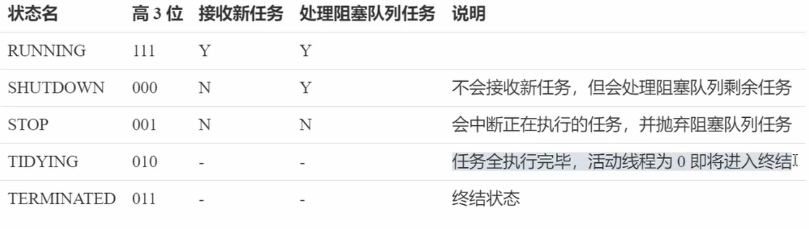

## 目录
- [1. 线程池](#线程池)
    - [1.1 线程池产生的原因](#线程池产生的原因)
    - [1.2 典型的应用场景](#典型的应用场景)
    - [1.3 自定义线程池](#自定义线程池)

---

## 线程池
### 线程池产生的原因
线程池产生主要是为了解决传统多线程编程中的 资源消耗 和 管理复杂度 等问题
> 一、直接诱因： 线程生命周期的高昂成本
>> 1、创建、销毁线程的开销
>>> 内存分配：每个线程需要分配独立的栈空间(默认1MB，可调整)   
>>> 系统调用：设计内核态和用户态切花  
>>> 资源初始化： 寄存器、线程局部存储等初始化成本
>> 例如：若每秒创建1000个线程，仅仅栈内空间消耗即到达1G，而且频繁的系统调用（也就是cpu的上下文切换）会显著的降低性能。  
> 
>> 2、线程数量失控风险   
>>> 操作系统限制：Linux默认线程数上限约1024   
>>> 资源耗尽：线程过多导致内存不足或者cpu过度切换
> 
> 二、性能瓶颈：上下文切换的代价
>> 1、cpu时间片浪费
>>> 切换成本：保存/恢复线程上下文  
>>> 缓存失效：频繁切换导致CPU缓存命中率下降
> 
>> 2、吞吐量下降
>>> 线程数公式：最佳线程数 ≈ CPU核数 × (1 + 等待时间/计算时间)   
>>> 盲目增加线程：导致大量时间浪费在线程调度而非实际任务处理
> 
> 三、线程池的核心价值
>> 1. 资源复用
>>> 线程预热：预先创建核心线程，避免任务到来时的延迟  
>>> 循环利用：处理完任务的线程回归池中等待下次任务
>
>> 2. 流量削峰
>>> 任务队列：缓冲突发请求（如 LinkedBlockingQueue）    
>>> 拒绝策略：自定义队列满时的处理方式（如丢弃、回退）
> 
>>场景示例：电商秒杀活动中，线程池可平滑处理瞬间涌入的 10 万请求，避免服务崩溃。

### 典型的应用场景


### 自定义线程池
线程池管理线程的大体架构图如下


[自定义线程池代码示例](src/main/java/com/daming/multithreading/Test31.java)

## ThreadPoolExecutor

### 线程池状态
ThreadPoolExecutor 使用int的高三位表示线程池状态，所以一共有5种状态，低29位表示线程数量   
  
从数字上比较，TERMINATED > TIDYING > STOP > SHUTDOWN > RUNNING   
这些信息存储在一个原子变量ctl种，目的是将线程池状态与线程个数合二为一，这样就可以用一次 cas 原子操作进行赋值  

### 构造方法(以下是截取源码中参数最齐全的一个构造方法讲解)
```java
public ThreadPoolExecutor(int corePoolSize,  // 核心线程数目(最多保留的线程数)
                              int maximumPoolSize, // 最大线程数=corePoolSize+非核心线程数(救急线程数)
                              long keepAliveTime, //生存时间--针对救急线程(非核心线程)
                              TimeUnit unit,  // 时间单位---针对救急线程
                              BlockingQueue<Runnable> workQueue, // 阻塞队列
                              ThreadFactory threadFactory,  // 线程工厂--主要用于创建线程，构建线程名称等信息
                              RejectedExecutionHandler handler) {  // 拒绝策略
        if (corePoolSize < 0 ||
            maximumPoolSize <= 0 ||
            maximumPoolSize < corePoolSize ||
            keepAliveTime < 0)
            throw new IllegalArgumentException();
        if (workQueue == null || threadFactory == null || handler == null)
            throw new NullPointerException();
        this.corePoolSize = corePoolSize;
        this.maximumPoolSize = maximumPoolSize;
        this.workQueue = workQueue;
        this.keepAliveTime = unit.toNanos(keepAliveTime);
        this.threadFactory = threadFactory;
        this.handler = handler;
    }
```
1、线程池刚开始没有线程，当一个任务提交给线程池队列后，线程池会创建一个新线程来执行任务。  
2、当线程数达到corePoolSize并没有线程空闲，这时再加入任务，新的任务会被加入到workQueue队列中排队，知道有空闲的线程   
3、如果队列选择了有界队列，那么任务超过了队列大小时，会创建maximumPoolSize-corePoolSize数目的线程来救急。   
4、如果线程达到了maximumPoolSize仍然有新任务这时会执行拒绝策略。拒绝策略JDK提供了4种实现，其他著名框架也提供了实现   
&nbsp;&nbsp;&nbsp;&nbsp;&nbsp;&nbsp;a、AbortPolicy让调用者抛出 RejectedExecutioException 异常，这是默认策略      
&nbsp;&nbsp;&nbsp;&nbsp;&nbsp;&nbsp;b、CallerRunsPolicy让调用者运行    
&nbsp;&nbsp;&nbsp;&nbsp;&nbsp;&nbsp;c、DiscardOldestPolicy放弃本次任务    
&nbsp;&nbsp;&nbsp;&nbsp;&nbsp;&nbsp;d、DiscardPolicy放弃任务队列中最早的任务，本任务取而代之  
&nbsp;&nbsp;&nbsp;&nbsp;&nbsp;&nbsp;e、Dubbo的实现，在抛出RejectedExecutioException异常之前会记录日志，并dump线程栈信息，方便定位问题。     
&nbsp;&nbsp;&nbsp;&nbsp;&nbsp;&nbsp;f、Netty的实现，是创建一个新的线程执行任务   
&nbsp;&nbsp;&nbsp;&nbsp;&nbsp;&nbsp;g、ActiveMQ的实现，带超时等待(60s)尝试放入队列，类似我们之前定义的拒绝策略    
&nbsp;&nbsp;&nbsp;&nbsp;&nbsp;&nbsp;h、PinPoint的实现，他使用了一个拒绝策略链，会逐一尝试策略链种的每种策略   
5、当高峰过后，超过corePoolSize的救急线程如果一段时间没有任务做，需要结束节省资源，这个时间由keepAliveTime和unit来控制。

根据这个构造方法，JDK Executors 类中提供了众多工厂方法来创建各种用途的线程池

#### Executors中的 newFixedThreadPool (创建一个固定大小的线程池)

源码如下
```java
    public static ExecutorService newFixedThreadPool(int nThreads, ThreadFactory threadFactory) {
        return new ThreadPoolExecutor(nThreads, nThreads,
                                      0L, TimeUnit.MILLISECONDS,
                                      new LinkedBlockingQueue<Runnable>(),
                                      threadFactory);
    }
```
特点   
1、核心线程数==最大线程数(没有救急线程被创建)，因此无需超时时间   
2、阻塞队列无界的，可以存放任意数量的任务   
适用于任务量已知，相对耗时的任务   
[newFixedThreadPool实例代码演示](src/main/java/com/daming/multithreading/Test32.java)

#### Executors中的 newCachedThreadPool (创建一个可缓存的线程池)

源码如下：
```java
    public static ExecutorService newCachedThreadPool() {
        return new ThreadPoolExecutor(0, Integer.MAX_VALUE,
                                      60L, TimeUnit.SECONDS,
                                      new SynchronousQueue<Runnable>());
    }
```
特点    
1、核心线程数是0，最大线程数是 Integer.MAX_VALUE，救急线程的空闲生存时间是 60s，意味着：
&nbsp;&nbsp;&nbsp;&nbsp;&nbsp;&nbsp;a、所有的线程都是救急线程(60s后可以回收)   
&nbsp;&nbsp;&nbsp;&nbsp;&nbsp;&nbsp;b、救急新城可以无限创建   
2、队列采用了SynchronousQueue实现。特点是，他没有容量，没有线程来取是放不进去的(一手交钱，一手交货)

整个线程池表现为线程数会根据任务量不断增长，没有上限，当任务执行完毕，空闲1分钟后释放线程。    
适合任务数比较密集，但每个任务执行时间较短的情况。

[SynchronousQueue示例代码演示](src/main/java/com/daming/multithreading/Test33.java)

#### Executors中的 newSingleThreadExecutor (创建一个单线程化的线程池)

源码如下
```java
    public static ExecutorService newSingleThreadExecutor() {
        return new FinalizableDelegatedExecutorService
            (new ThreadPoolExecutor(1, 1,
                                    0L, TimeUnit.MILLISECONDS,
                                    new LinkedBlockingQueue<Runnable>()));
    }
```
使用场景：     
希望多个任务排队执行。线程数固定为1，任务数多于1时，会放入无界队列排队。任务执行完毕，这唯一的线程也不会释放。

区别：  
1、自己创建一个单线程串行执行任务，如果任务执行失败而终止那么没有任何补救措施，而线程池还会新建一个线程，保证池的正常工作   
2、Executors.newSingleThreadExecutor()线程个数始终为1，不能修改   
&nbsp;&nbsp;&nbsp;&nbsp;&nbsp;&nbsp;a、FinalizableDelegatedExecutorService应用的是装饰器模式，只对外暴露了ExecutorService接口，因此不能调用ThreadPoolExecutor中特有的方法   
3、Executors.newFixedThreadPool(1)初始化为1时，以后还可以修改   
&nbsp;&nbsp;&nbsp;&nbsp;&nbsp;&nbsp;a、对外暴露的是ThreadPoolExecutor对象，可以强转后调用ThreadPoolExecutor中setCorePoolSize()方法修改线程池大小   

[newSingleThreadExecutor实例代码演示](src/main/java/com/daming/multithreading/Test34.java)

#### 提交任务方法

```java
// 执行任务
void execute(Runnable command);

// 提交任务 task ，用返回值future 获得任务执行结果  
<T> Future<T> submit(Callable<T> task);

// 提交tasks中所有任务  
<T> List<Future<T>> invokeAll(Collection<? extends Callable<T>> tasks) throws InterruptedException;

// 提交tasks中所有任务，带超时时间
<T> List<Future<T>> invokeAll(Collection<? extends Callable<T>> tasks, long timeout, TimeUnit unit) throws InterruptedException;

// 提交tasks中所有任务，哪个任务先成功执行完毕，返回此任务执行结果，其他任务取消
<T> T invokeAny(Collection<? extends Callable<T>> tasks) throws InterruptedException, ExecutionException;

// 提交tasks中所有任务，带超时时间，哪个任务先成功执行完毕，返回此任务执行结果，其他任务取消，带超时时间
<T> T invokeAny(Collection<? extends Callable<T>> tasks, long timeout, TimeUnit unit) throws Interrupted

```

[提交任务方法的代码示例演示](src/main/java/com/daming/multithreading/Test35.java)
