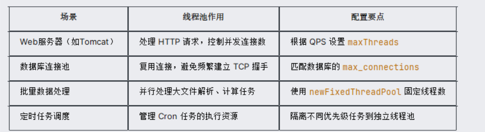
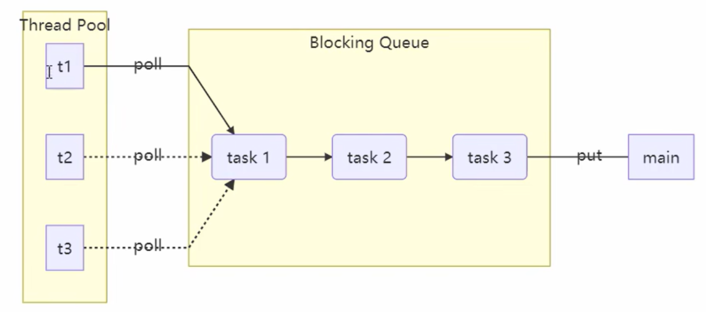

## 线程池
### 线程池产生的原因
线程池产生主要是为了解决传统多线程编程中的 资源消耗 和 管理复杂度 等问题
> 一、直接诱因： 线程生命周期的高昂成本
>> 1、创建、销毁线程的开销
>>> 内存分配：每个线程需要分配独立的栈空间(默认1MB，可调整)   
>>> 系统调用：设计内核态和用户态切花  
>>> 资源初始化： 寄存器、线程局部存储等初始化成本
>> 例如：若每秒创建1000个线程，仅仅栈内空间消耗即到达1G，而且频繁的系统调用（也就是cpu的上下文切换）会显著的降低性能。  
> 
>> 2、线程数量失控风险   
>>> 操作系统限制：Linux默认线程数上限约1024   
>>> 资源耗尽：线程过多导致内存不足或者cpu过度切换
> 
> 二、性能瓶颈：上下文切换的代价
>> 1、cpu时间片浪费
>>> 切换成本：保存/恢复线程上下文  
>>> 缓存失效：频繁切换导致CPU缓存命中率下降
> 
>> 2、吞吐量下降
>>> 线程数公式：最佳线程数 ≈ CPU核数 × (1 + 等待时间/计算时间)   
>>> 盲目增加线程：导致大量时间浪费在线程调度而非实际任务处理
> 
> 三、线程池的核心价值
>> 1. 资源复用
>>> 线程预热：预先创建核心线程，避免任务到来时的延迟  
>>> 循环利用：处理完任务的线程回归池中等待下次任务
>
>> 2. 流量削峰
>>> 任务队列：缓冲突发请求（如 LinkedBlockingQueue）    
>>> 拒绝策略：自定义队列满时的处理方式（如丢弃、回退）
> 
>>场景示例：电商秒杀活动中，线程池可平滑处理瞬间涌入的 10 万请求，避免服务崩溃。

### 典型的应用场景


### 自定义线程池
线程池管理线程的大体架构图如下


步骤一：自定义拒绝策略接口   
```java
interface RejectPolicy<T> {
    void reject(BlockingQueue<T> queue, T task);
}
```