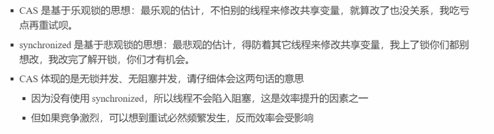

## 目录
- [1. CAS和volatile](#CAS和volatile)
    - [1.1 CAS是什么？](#CAS是什么？)
    - [1.2 Java中的原子类型中CAS和volatile关键字的作用？](#Java中的原子类型中cas和volatile关键字的作用？)
    - [1.3 CAS的特点](#CAS的特点)
- [2. 原子类型](#2-原子类型)
    - [2.1 原子整数-AtomicInteger](#21-原子整数-atomicinteger)
    - [2.2 原子引用-AtomicReference](#22-原子引用-atomicreference)
    - [2.3 LongAdder原理-cas锁](#23-longadder原理-cas锁)
---
## CAS和volatile
### CAS是什么？
> CAS（Compare And Swap,比较并交换）是实现无锁并发编程的核心原子操作，用于多线程环境下确保数据操作的原子性，核心要点如下：
>> CAS操作包含三个关键参数
>>> 内存位置（V）：需要更新的共享变量地址    
>>> 预期原值(A): 线程读取时的旧值    
>>> 更新值(B): 线程更新时希望写入的新值
```java
if (V == A) {   // 比较内存当前值是否等于预期原值
    V = B;      // 若相等则更新为新值
    return true; 
} else {
    return false; // 不相等则放弃操作
}
```

### Java中的原子类型中cas和volatile关键字的作用？
> 获取共享变量时，为了保证该变量的可见性，需要使用volatile修饰。  
> 它可以用来修饰成员变量和静态成员变量，   
> 他可以避免线程从自己的工作缓存中查找变量的值，  
> 必须到主存中获取他的值，   
> 线程操作volatile变量都是直接操作主存。   
> 即一个线程对volatile变量的修改，对另一个线程可见
>> volatile仅仅保证了共享变量的可见性，让其他线程能够看到最新值，但不能解决指令交错的问题(也就是不能保证原子性)
> 
> CAS必须借助volatile才能读取到共享变量的最新值来实现 【比较并交换】 的效果，从而实现原子性

### CAS的特点
> 结合CAS和volatile可以实现无锁并发，适用于线程少，多核的cpu的场景下。


## 原子类型

### 原子整数-AtomicInteger

### 原子引用-AtomicReference

### LongAdder原理-cas锁